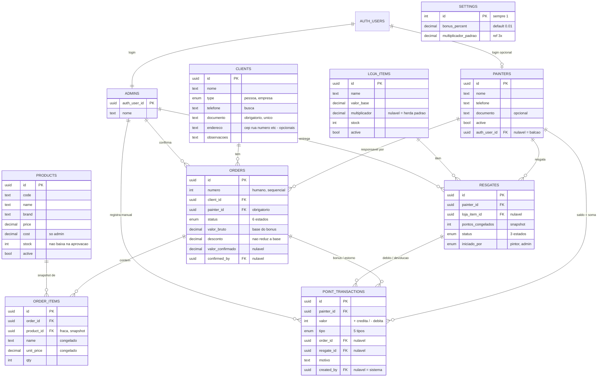

# Inventário do schema — Supabase (Minas Tintas PWA)

> **Fonte de verdade:** as migrations em `APLICATIVO PWA/supabase/migrations/`.
> Este documento é o **mapa legível** do schema — para entender o porquê de cada
> tabela sem ler SQL. Se houver divergência, a migration vence; este doc é atualizado
> para acompanhá-la.

O schema cobre o domínio do briefing (`Minas Tintas/03 - Briefing/briefing.md`):
pintores parceiros montam orçamentos, a loja confirma o pagamento, o sistema credita
bônus em pontos ao pintor responsável, e os pontos são trocados por itens numa lojinha
de pontos.

---

## Princípio condutor: guardar o fato, derivar o rótulo

A decisão mais importante do schema, e a que explica várias "ausências" de colunas:
**nada que possa ser derivado é guardado.** Isso evita o problema de duas fontes de
verdade que divergem (a mesma lição do bônus que estava espalhado em 5 lugares antes
de ser centralizado em `rules.ts`).

São **derivados, nunca colunas**:

| Derivado                         | Como se calcula                                                           |
| -------------------------------- | ------------------------------------------------------------------------- |
| Saldo de pontos do pintor        | `sum(valor)` em `point_transactions` daquele pintor                       |
| Pintores vinculados a um cliente | relido de `orders` (agrupado por pintor, ordenado por data)               |
| Bônus/pontos de um pedido        | a linha `tipo='bonus'` no ledger gerada na confirmação                    |
| Custo em pontos de um item       | `round(valor_base × (multiplicador ?? multiplicador_padrao))`             |
| "Item em promoção?"              | `multiplicador < multiplicador_padrao` (só **abaixo** do padrão tem selo) |
| "Item bloqueado?" (cadeado)      | `saldo do pintor < custo do item`                                         |

---

## Diagrama (ER)

---

## Tipos enumerados

Listas fixas de valores válidos. São a fonte de verdade dos status — o banco recusa
qualquer valor fora da lista. Valores em código interno (sem acento/espaço); a tradução
para texto bonito acontece na interface.

| Enum             | Valores                                                                  | Usado em                  |
| ---------------- | ------------------------------------------------------------------------ | ------------------------- |
| `order_status`   | `rascunho`, `pendente`, `aprovado`, `recusado`, `cancelado`, `estornado` | `orders.status`           |
| `point_tx_type`  | `bonus`, `resgate`, `estorno`, `ajuste`, `devolucao`                     | `point_transactions.tipo` |
| `resgate_status` | `pendente_retirada`, `entregue`, `cancelado`                             | `resgates.status`         |
| `client_type`    | `pessoa`, `empresa`                                                      | `clients.type`            |
| `resgate_origin` | `pintor`, `admin`                                                        | `resgates.iniciado_por`   |

**Sobre `order_status`:** `cancelado` e `recusado` só vêm de antes da aprovação (nunca
tiveram bônus). `estornado` só vem de `aprovado` (teve bônus, revertido por uma linha de
estorno no ledger). Essa distinção permite à loja ver, na lista, se um pedido anulado
chegou a gerar pontos — sem cruzar com o histórico.

---

## Tabelas

### Configuração

**`settings`** — linha única (`id` travado em 1 por constraint). Guarda o valor de
_agora_; não versiona, porque o passado fica congelado no ledger e nos snapshots.

- `bonus_percent` `numeric(5,4)` default `0.01` — percentual de bônus sobre o valor bruto.
- `multiplicador_padrao` `numeric(4,2)` default `3.0` — multiplicador padrão da lojinha.

### Identidade e acesso

**`painters`** — fonte de verdade do parceiro. **Todo** pintor tem linha aqui, com app ou sem.

- `auth_user_id` → `auth.users`, **nulável**, `unique`, `on delete set null`. Vazio = pintor
  de balcão (sem login; a loja age por ele). Se o login some, o pintor **não** some — vira balcão.
- `telefone` — **obrigatório e único** (`not null unique`). É a **credencial de login** do pintor:
  o login do app Pintor é por telefone (normalizado para só dígitos com DDD, ex. `33999990000`).
  Por baixo, o auth usa um e-mail sintético derivado: `{telefone}@pintor.local`.
- `email` — **opcional**, é **contato**, não login (reservado para recuperação por e-mail futura).
  O e-mail do `auth.users` é sempre o sintético; este é o e-mail real, quando informado.
- `active` — ativo/inativo (admin liga/desliga; pintor não é apagado, é inativado).
- `documento` opcional (assimetria proposital com o cliente).

**`admins`** — nasce da auth (admin sem login não faz sentido).

- PK = `auth_user_id` → `auth.users`, `on delete cascade` (sem histórico financeiro próprio).

### Domínio comercial

**`clients`**

- `documento` `not null unique` — CPF/CNPJ é o identificador único do cliente (briefing).
- Endereço em colunas opcionais (`cep`, `rua`, `numero`, `complemento`, `bairro`, `cidade`).
- **Sem coluna de pintor** — vínculo é derivado de `orders`.

**`products`** — catálogo de venda (orçamentos), cadastrado manualmente pelo admin.
Módulo **separado** da lojinha de pontos.

- `cost` é sensível (só admin enxerga — via RLS, pendente).
- `stock` **não** baixa na aprovação (informativo).

**`orders`** — tabela única; o `status` carrega o ciclo de vida (não há tabela separada
de "compra confirmada").

- `titulo` — nome da obra/projeto do orçamento (ex.: "Igreja São Francisco"), nulável;
  autorado na criação do orçamento (3b).
- `numero` `generated always as identity` — id humano/sequencial (o "número do orçamento"),
  além do `id` uuid interno.
- `client_id`/`painter_id` `not null`, `on delete restrict` — não dá pra apagar cliente/pintor
  com pedidos. `painter_id` é obrigatório e reatribuível (decisão de negócio).
- `valor_bruto` = **base do bônus**, congelada. `desconto` ao cliente **não** reduz a base.
- Confirmação nasce nula: `confirmed_at`, `confirmed_by` (→ admins, `set null`),
  `valor_confirmado` (real pago), `nota_fiscal`.
- **Sem coluna de bônus** — o crédito é uma linha no ledger, na confirmação.

**`order_items`** — itens do pedido, como **snapshot**.

- `order_id` `on delete cascade` — item não existe sem o pedido (relação pai-filho).
- `product_id` → products, **nulável**, `on delete set null` — referência fraca: o item
  carrega `name` e `unit_price` **congelados**, então sobrevive se o produto mudar/sumir.
- `qty` `check (qty > 0)`.

### Pontos e lojinha

**`loja_items`** — item da lojinha de pontos.

- `multiplicador` `numeric(4,2)` **nulável**: vazio = herda `settings.multiplicador_padrao`.
  Definido = override (abaixo do padrão vira promoção; acima é só mais caro). "Voltar a herdar"
  = apagar o campo (voltar a nulo), **não** copiar o padrão.
- `stock` `check (stock >= 0)`.
- Custo em pontos é derivado (não há coluna de custo).

**`resgates`** — estado-máquina de 3 status.

- `pontos_congelados` — snapshot do custo no momento do resgate, para a devolução reembolsar
  exatamente o que foi debitado (mesmo princípio do snapshot de itens de pedido).
- `painter_id` `restrict`; `loja_item_id` nulável `set null`; `entregue_por` → admins `set null`.
- `iniciado_por` (`pintor`/`admin`) — pintor pelo app, ou admin em nome do pintor de balcão.
- Timestamps por marco: `created_at`, `entregue_em`, `cancelado_em` (nascem nulos).
- **Sem coluna de débito** — o débito é uma linha no ledger.

**`point_transactions`** — o **ledger**. Linhas imutáveis; o saldo é a soma.

- `valor` `integer`, `check (valor <> 0)` — sinal é a direção (+ credita, − debita).
- `tipo` (`point_tx_type`) + origem polimórfica: `order_id` (bônus/estorno) **ou** `resgate_id`
  (resgate/devolução) **ou** nenhum (ajuste).
- `created_by` → admins, nulável (`set null`) — nulo = sistema (ex.: bônus automático).
- Origens com `set null` (não cascade): apagar pedido/resgate **não** apaga a transação —
  o saldo do pintor não muda retroativamente.
- **Constraints de coerência:**
  - `tx_origem_coerente`: garante a regra polimórfica (tipo ↔ qual origem está preenchida).
  - `tx_motivo_obrigatorio`: `ajuste` e `estorno` exigem `motivo` (auditoria do briefing).

---

## Views (derivações)

### `painter_stats`

View de leitura que calcula em tempo de consulta os números derivados do pintor — fiel ao princípio
"guardar o fato, derivar o rótulo": nada aqui é coluna guardada.

| Campo                                                                  | Origem                                                                           |
| ---------------------------------------------------------------------- | -------------------------------------------------------------------------------- |
| `id`, `nome`, `telefone`, `documento`, `email`, `active`, `created_at` | passados direto de `painters`                                                    |
| `pedidos`                                                              | `count` dos `orders` não-rascunho (rascunho é WIP do pintor, não conta p/ admin) |
| `aprovados`                                                            | `count` dos `orders` com `status = 'aprovado'`                                   |
| `volume`                                                               | `sum(orders.valor_bruto)` dos aprovados (base do bônus)                          |
| `saldo`                                                                | `sum(point_transactions.valor)` do pintor (o ledger é a verdade)                 |

Dois pontos técnicos travados:

- **`security_invoker = on`** — a view aplica a RLS das tabelas-base **como o usuário que consulta**,
  não como o dono da view. Assim o admin vê todas as linhas e o pintor vê só a própria — o que
  permite reusar a mesma view no app do pintor (saldo na home) sem vazar dados de terceiros. Sem
  isso, rodaria com os privilégios do dono e furaria a RLS.
- **`saldo` por subconsulta correlacionada, não por segundo `left join`** — juntar `orders` **e**
  `point_transactions` na mesma query faz o fan-out de uma inflar o agregado da outra. `pedidos`/
  `volume` saem do join com `orders`; `saldo` sai de subconsulta isolada.

Consumida pelas telas **Pintores (lista)** e **Pintor (detalhe)** do admin (`painter_stats` → mapper → client).

---

### `pedidos_admin`

Pedidos para o admin: resolve nomes e dois derivados do ledger. `security_invoker = on`.

| Campo                                          | Origem                                                       |
| ---------------------------------------------- | ------------------------------------------------------------ |
| campos de `orders` (incl. `titulo`)            | passados direto                                              |
| `painter_nome`, `client_nome`, `client_cidade` | join `painters` / `clients`                                  |
| `bonus_creditado`                              | `sum` das linhas `bonus` do ledger do pedido (0 até aprovar) |
| `estorno_motivo`                               | `motivo` da linha `estorno` do ledger (se houver)            |

`bonus_creditado` é a **verdade do ledger**, não recálculo por % atual. Consumida pelas telas
de Pedidos (lista/detalhe) e pelo detalhe do pintor.

### `loja_items_admin`

Itens da lojinha com o custo em pontos derivado. `security_invoker = on`.

| Campo                  | Origem                                                                 |
| ---------------------- | ---------------------------------------------------------------------- |
| campos de `loja_items` | passados direto                                                        |
| `custo_pts`            | `round(valor_base × (multiplicador ?? settings.multiplicador_padrao))` |
| `promo`                | `multiplicador is not null and multiplicador < padrão`                 |

`cross join settings` traz o multiplicador global (linha única) pra cada item; o `coalesce`
faz herdar o padrão quando o item não tem multiplicador próprio.

### `resgates_admin`

Resgates com nomes resolvidos. `security_invoker = on`.

| Campo                      | Origem                                       |
| -------------------------- | -------------------------------------------- |
| campos de `resgates`       | passados direto                              |
| `painter_nome`             | join `painters`                              |
| `item_nome`, `item_imagem` | `left join loja_items` (nulável, `set null`) |

### `clients_admin`

Clientes para o admin + o **pintor mais recente** de cada um (derivado de `orders`, pois
`clients` não tem coluna de pintor). `security_invoker = on`.

| Campo               | Origem                                                             |
| ------------------- | ------------------------------------------------------------------ |
| campos de `clients` | passados direto                                                    |
| `painter_nome`      | nome do pintor do **pedido mais recente** do cliente (`null` se 0) |

Consumida pela tela **Clientes** (admin, rota `dashboard`).

### `products_public`

Catálogo exposto ao **pintor** — `products` **sem `cost`** (sensível). Diferente das outras
views, roda **`security_invoker = off`** (como dono): ignora a RLS só-admin de `products` e lista
os ativos; o custo nunca vaza. `grant select to authenticated`.

| Campo                                 | Origem              |
| ------------------------------------- | ------------------- |
| `id, code, name, brand, price, stock` | `products` (ativos) |

Consumida pela tela de **Orçamento** (pintor), via o payload do layout `(app)`.

## Comportamento de `on delete` (resumo)

A escolha não é regra fixa — é "o que deve acontecer com esta linha quando o outro lado some":

- **`restrict`** — quando apagar destruiria histórico (cliente/pintor com pedidos; pintor com transações).
- **`cascade`** — quando o filho não faz sentido sem o pai (`order_items` → `orders`).
- **`set null`** — quando o registro sobrevive mas perde uma referência opcional (login do pintor;
  admin que confirmou; produto/item de origem em registros históricos).

---

## Acesso (RLS) — implementado

Todas as tabelas têm **Row Level Security** ligado (nenhuma fica `UNRESTRICTED`). O acesso é
negado por padrão; as policies abaixo liberam **leitura**. A **escrita** segue o roteamento da
seção _Escrita — RPCs (camada 3b)_ abaixo: escrita simples escopada por papel → policy; escrita
atômica / que fura a RLS de leitura (ledger, status+bônus, resgate+estoque, pedido+itens) →
RPC `SECURITY DEFINER`.

Funções auxiliares (`SECURITY DEFINER`, evitam recursão nas policies):

- `is_admin()` — o `auth.uid()` atual está em `admins`?
- `current_painter_id()` — o `painters.id` do usuário logado.

| Tabela                                     | Quem lê                                                                                  |
| ------------------------------------------ | ---------------------------------------------------------------------------------------- |
| `admins`                                   | a própria linha (auto-leitura)                                                           |
| `painters`                                 | a própria linha; admin lê todas                                                          |
| `clients`                                  | admin lê todos; pintor lê os clientes com quem tem pedido (vínculo derivado de `orders`) |
| `orders`, `point_transactions`, `resgates` | pintor lê os seus (`painter_id = current_painter_id()`); admin lê tudo                   |
| `order_items`                              | herda do pedido pai (vê o item se vê o pedido)                                           |
| `loja_items`, `settings`                   | qualquer autenticado                                                                     |
| `products`                                 | só admin (contém `cost` sensível; pintor ainda não consome catálogo)                     |

**Escrita por policy** (escrita simples escopada por papel, sem RPC):

| Tabela       | Quem escreve                                | Operações                                                                        |
| ------------ | ------------------------------------------- | -------------------------------------------------------------------------------- |
| `clients`    | admin (`is_admin()`)                        | INSERT, UPDATE (sem DELETE: cliente não tem `active`; FK `restrict` de `orders`) |
| `loja_items` | admin (`is_admin()`)                        | INSERT, UPDATE (sem DELETE: "remover" será `active=false`)                       |
| `settings`   | admin (`is_admin()`)                        | UPDATE (singleton id=1)                                                          |
| `painters`   | admin (`is_admin()`)                        | UPDATE (nome/documento/active; criação é pelo route `/api/pintores`)             |
| `admins`     | a própria linha (`auth_user_id=auth.uid()`) | UPDATE (nome)                                                                    |

As demais escritas (atômicas, que furam a RLS de leitura, ou de autoria do sistema) passam por RPC.

**Imutabilidade do ledger:** `point_transactions` tem um trigger (`trg_ledger_imutavel`) que
**aborta qualquer UPDATE ou DELETE** — inclusive via `service_role`. Só INSERT é permitido.
Correções são feitas por linha compensatória (estorno/ajuste/devolução), nunca editando o passado.

## Escrita — RPCs (camada 3b)

Roteamento (do CLAUDE.md): **escrita simples de uma tabela escopada ao dono → policy**;
**escrita atômica / de autoria do sistema / que fura a RLS de leitura → RPC `SECURITY DEFINER`**
chamada por server action. As RPCs resolvem a identidade pelo JWT (`current_painter_id()` /
`is_admin()` + `auth.uid()`), **nunca por parâmetro**, e travam as linhas afetadas (`FOR UPDATE`)
para verificar invariantes antes de agir (anti double-spend / double-approve). Execução concedida
só a `authenticated`.

| RPC                                          | Quem   | O que faz (atômico)                                                                                                                                                                                                                         |
| -------------------------------------------- | ------ | ------------------------------------------------------------------------------------------------------------------------------------------------------------------------------------------------------------------------------------------- |
| `resgatar_item(item)`                        | pintor | trava o pintor; recalcula o custo (mesma fórmula da view); checa saldo; baixa estoque; cria `resgates` (snapshot em `pontos_congelados`) + linha `resgate` (−) no ledger                                                                    |
| `cancelar_resgate(resgate)`                  | pintor | só o próprio e só `pendente_retirada`; marca `cancelado`; devolve estoque; credita `devolucao` (+snapshot)                                                                                                                                  |
| `aprovar_pedido(pedido)`                     | admin  | `pendente→aprovado`; preenche `confirmed_*` e `valor_confirmado`; credita `bonus` = `round(valor_bruto × settings.bonus_percent)` no ledger                                                                                                 |
| `recusar_pedido(pedido)`                     | admin  | `pendente→recusado`; sem ledger (RPC só para não expor `UPDATE` de `orders` ao client)                                                                                                                                                      |
| `estornar_pedido(pedido, motivo)`            | admin  | `aprovado→estornado`; reverte o bônus **realmente creditado** (soma das linhas `bonus`) como linha `estorno`; `motivo` obrigatório                                                                                                          |
| `enviar_orcamento(cliente, itens)`           | pintor | cria `orders` (pendente) + `order_items` numa transação; **preço sempre de `products`** (cliente manda só `product_id`+`qty`); cliente = id existente (precisa ser do pintor) ou novo por **find-or-create no `documento`**                 |
| `entregar_resgate(resgate)`                  | admin  | `pendente_retirada→entregue`; carimba `entregue_em`/`entregue_por`; **sem ledger** (pontos já debitados no resgate)                                                                                                                         |
| `cancelar_resgate_admin(resgate)`            | admin  | `pendente_retirada→cancelado`; devolve estoque + credita `devolucao` (snapshot); espelha `cancelar_resgate`, mas gated por `is_admin` e resolvendo o pintor da própria linha                                                                |
| `criar_pedido_admin(pintor, cliente, itens)` | admin  | cria `orders`+`order_items` **já aprovado** (confirma + credita bônus na hora); pintor por parâmetro (precisa estar ativo); cliente = id existente; preço autoritativo de `products`. Espelha `enviar_orcamento`+`aprovar_pedido` num passo |

Dois pontos de segurança que se repetem:

- **Preço autoritativo:** `enviar_orcamento` ignora qualquer preço vindo do cliente e lê de
  `products` — senão o pintor inflaria o `valor_bruto` e o próprio bônus.
- **Bônus na taxa de _agora_:** `aprovar_pedido` lê `settings.bonus_percent` em runtime (mesma
  taxa que o preview da tela usa), então o creditado bate com o previsto.

As server actions que chamam as RPCs ficam em: `dashboard/actions.ts` (cliente admin),
`lib/resgate-actions.ts` (pintor), `pedidos/actions.ts` (admin: decisão de pedido + criar pedido),
`lib/orcamento-actions.ts` (pintor) e `lojinha/actions.ts` (admin: gestão de resgate). Após a
escrita, `router.refresh()` reSemeia o payload do layout (saldo, pendentes, pedidos) — não há mais
estado otimista para esses dados.

## Pendências (pós-3b)

**Feito na 3b (escrita do core completa):** cliente (admin CRUD), resgate do pintor
(resgatar/cancelar), decisão de pedido (aprovar/recusar/estornar), enviar orçamento (pintor),
CRUD de item da lojinha + multiplicador padrão, gestão de resgate pelo admin (entregar/recusar),
`bonus_percent` editável na configuracoes, cadastrar/editar/resetar/ativar pintor, criar pedido
pelo admin (já aprovado), conta do admin (nome + senha). Leituras reais ligadas (catálogo,
clientes do pintor, e painters/clients/products no payload de pedidos).

**Decisões adiadas (conscientes):**

1. **Imagens via Supabase Storage:** item da lojinha e foto do admin gravam tudo **menos imagem**
   (base64 não serve em coluna `text`; bloco próprio de Storage — bucket + URL na coluna `imagem`).
   O recorte (`imgPos`) também espera esse bloco.
2. **Agenda standalone de cliente do pintor:** criação de cliente pelo pintor vive **dentro do
   orçamento** (find-or-create por `documento`). Cadastro standalone na aba Clientes do perfil fica
   adiado — Opção 1 (coluna `created_by_painter` + ampliar a policy de leitura para "criou OU tem
   pedido").
3. **Endereço do pintor:** `painters` não tem colunas de endereço; o form coleta mas **não grava**.
   Se desejado: colunas em `painters` + estender o route `POST /api/pintores`.
4. **Normalizar `documento` para dígitos:** gravado **mascarado** (convenção; `unique` sobre o texto
   cru). Normalizar = migração de dados + tocar nos dois apps + formatar na exibição.

**`rules.ts` × `settings.bonus_percent`:** o **crédito autoritativo** lê `settings` em runtime
(`aprovar_pedido` / `criar_pedido_admin`) e a taxa é editável (configuracoes). Falta só o **preview**
do pintor (`bonusPts` via `rules.ts`) deixar a constante estática e ler a taxa do payload — cosmético.

**Futuro (auth / SMTP):** troca de **e-mail** do admin e **recuperação de senha** por e-mail (exigem
SMTP próprio — hoje o e-mail do admin é read-only); troca de **telefone** do pintor (é troca de
credencial: atualizar `painters.telefone` **e** o e-mail sintético do `auth.users` juntos). Outros:
tela in-app de guia de instalação do PWA (iPhone/Safari).

---

## Migrations (ordem de aplicação)

| Arquivo                                | Conteúdo                                                                              |
| -------------------------------------- | ------------------------------------------------------------------------------------- |
| `…_fundacao_enums_settings.sql`        | 5 enums + tabela `settings` (linha única)                                             |
| `…_entidades_base.sql`                 | `painters`, `admins`, `clients`, `products`                                           |
| `…_pedidos.sql`                        | `orders`, `order_items`                                                               |
| `…_lojinha_e_ledger.sql`               | `loja_items`, `resgates`, `point_transactions`                                        |
| `…_painter_telefone_unico.sql`         | `painters.telefone` obrigatório + único (credencial)                                  |
| `…_painter_email_contato.sql`          | `painters.email` (contato, opcional)                                                  |
| `…_rls_identidade.sql`                 | RLS em `admins`/`painters` + função `is_admin()`                                      |
| `…_rls_dominio.sql`                    | RLS de leitura no comercial/pontos/lojinha/settings/products + `current_painter_id()` |
| `…_ledger_imutavel.sql`                | trigger de imutabilidade em `point_transactions`                                      |
| `…_rls_clients.sql`                    | RLS faltante em `clients`                                                             |
| `…_painter_stats_view.sql`             | view `painter_stats` (derivações do pintor, `security_invoker`)                       |
| `…_orders_titulo.sql`                  | coluna `orders.titulo`                                                                |
| `…_pedidos_admin_view.sql`             | view `pedidos_admin` (nomes + bônus/estorno derivados)                                |
| `…_lojinha_views.sql`                  | views `loja_items_admin`, `resgates_admin`                                            |
| `…_painter_stats_excluir_rascunho.sql` | `painter_stats.pedidos` passa a excluir rascunho                                      |
| `…_clients_admin_view.sql`             | view `clients_admin` (cliente + pintor mais recente)                                  |
| `…_products_public_view.sql`           | view `products_public` (catálogo ao pintor, sem `cost`, `security_invoker` off)       |
| `…_rls_clients_escrita_admin.sql`      | policies `INSERT`/`UPDATE` de `clients` (admin)                                       |
| `…_resgate_rpcs.sql`                   | RPCs `resgatar_item`, `cancelar_resgate` (pintor)                                     |
| `…_pedido_rpcs.sql`                    | RPCs `aprovar_pedido`, `recusar_pedido`, `estornar_pedido` (admin)                    |
| `…_orcamento_rpc.sql`                  | RPC `enviar_orcamento` (pintor)                                                       |
| `…_rls_loja_items_escrita_admin.sql`   | policies `INSERT`/`UPDATE` de `loja_items` (admin)                                    |
| `…_resgate_admin_rpcs.sql`             | RPCs `entregar_resgate`, `cancelar_resgate_admin` (admin)                             |
| `…_rls_settings_escrita_admin.sql`     | policy `UPDATE` de `settings` (admin)                                                 |
| `…_criar_pedido_admin_rpc.sql`         | RPC `criar_pedido_admin` (pedido já aprovado)                                         |
| `…_rls_painters_escrita_admin.sql`     | policy `UPDATE` de `painters` (admin: nome/documento/active)                          |
| `…_rls_admins_self_update.sql`         | policy `UPDATE` de `admins` (self: nome)                                              |

Banco hospedado (Supabase free tier). Migrations aplicadas via `supabase db push`
(projeto linkado por `supabase link`). Para recriar o schema do zero: clonar o repo,
linkar a um projeto Supabase e rodar `supabase db push`.
