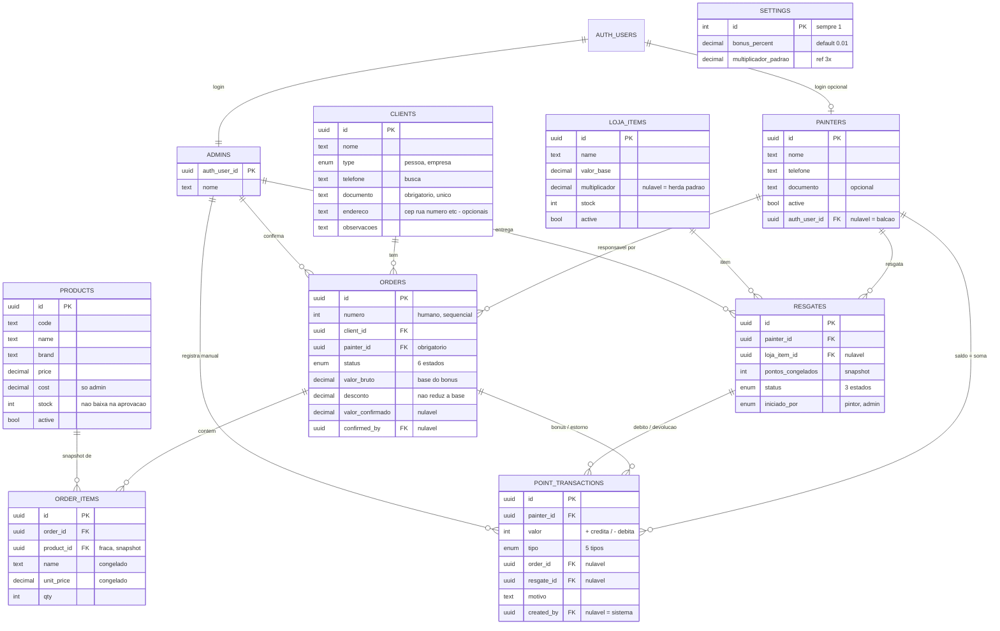

# Inventário do schema — Supabase (Minas Tintas PWA)

> **Fonte de verdade:** as migrations em `APLICATIVO PWA/supabase/migrations/`.
> Este documento é o **mapa legível** do schema — para entender o porquê de cada
> tabela sem ler SQL. Se houver divergência, a migration vence; este doc é atualizado
> para acompanhá-la.

O schema cobre o domínio do briefing (`Minas Tintas/03 - Briefing/briefing.md`):
pintores parceiros montam orçamentos, a loja confirma o pagamento, o sistema credita
bônus em pontos ao pintor responsável, e os pontos são trocados por itens numa lojinha
de pontos.

---

## Princípio condutor: guardar o fato, derivar o rótulo

A decisão mais importante do schema, e a que explica várias "ausências" de colunas:
**nada que possa ser derivado é guardado.** Isso evita o problema de duas fontes de
verdade que divergem (a mesma lição do bônus que estava espalhado em 5 lugares antes
de ser centralizado em `rules.ts`).

São **derivados, nunca colunas**:

| Derivado                         | Como se calcula                                                           |
| -------------------------------- | ------------------------------------------------------------------------- |
| Saldo de pontos do pintor        | `sum(valor)` em `point_transactions` daquele pintor                       |
| Pintores vinculados a um cliente | relido de `orders` (agrupado por pintor, ordenado por data)               |
| Bônus/pontos de um pedido        | a linha `tipo='bonus'` no ledger gerada na confirmação                    |
| Custo em pontos de um item       | `round(valor_base × (multiplicador ?? multiplicador_padrao))`             |
| "Item em promoção?"              | `multiplicador < multiplicador_padrao` (só **abaixo** do padrão tem selo) |
| "Item bloqueado?" (cadeado)      | `saldo do pintor < custo do item`                                         |

---

## Diagrama (ER)

---

## Tipos enumerados

Listas fixas de valores válidos. São a fonte de verdade dos status — o banco recusa
qualquer valor fora da lista. Valores em código interno (sem acento/espaço); a tradução
para texto bonito acontece na interface.

| Enum             | Valores                                                                  | Usado em                  |
| ---------------- | ------------------------------------------------------------------------ | ------------------------- |
| `order_status`   | `rascunho`, `pendente`, `aprovado`, `recusado`, `cancelado`, `estornado` | `orders.status`           |
| `point_tx_type`  | `bonus`, `resgate`, `estorno`, `ajuste`, `devolucao`                     | `point_transactions.tipo` |
| `resgate_status` | `pendente_retirada`, `entregue`, `cancelado`                             | `resgates.status`         |
| `client_type`    | `pessoa`, `empresa`                                                      | `clients.type`            |
| `resgate_origin` | `pintor`, `admin`                                                        | `resgates.iniciado_por`   |

**Sobre `order_status`:** `cancelado` e `recusado` só vêm de antes da aprovação (nunca
tiveram bônus). `estornado` só vem de `aprovado` (teve bônus, revertido por uma linha de
estorno no ledger). Essa distinção permite à loja ver, na lista, se um pedido anulado
chegou a gerar pontos — sem cruzar com o histórico.

---

## Tabelas

### Configuração

**`settings`** — linha única (`id` travado em 1 por constraint). Guarda o valor de
_agora_; não versiona, porque o passado fica congelado no ledger e nos snapshots.

- `bonus_percent` `numeric(5,4)` default `0.01` — percentual de bônus sobre o valor bruto.
- `multiplicador_padrao` `numeric(4,2)` default `3.0` — multiplicador padrão da lojinha.

### Identidade e acesso

**`painters`** — fonte de verdade do parceiro. **Todo** pintor tem linha aqui, com app ou sem.

- `auth_user_id` → `auth.users`, **nulável**, `unique`, `on delete set null`. Vazio = pintor
  de balcão (sem login; a loja age por ele). Se o login some, o pintor **não** some — vira balcão.
- `active` — ativo/inativo (admin liga/desliga; pintor não é apagado, é inativado).
- `documento` opcional (assimetria proposital com o cliente).

**`admins`** — nasce da auth (admin sem login não faz sentido).

- PK = `auth_user_id` → `auth.users`, `on delete cascade` (sem histórico financeiro próprio).

### Domínio comercial

**`clients`**

- `documento` `not null unique` — CPF/CNPJ é o identificador único do cliente (briefing).
- Endereço em colunas opcionais (`cep`, `rua`, `numero`, `complemento`, `bairro`, `cidade`).
- **Sem coluna de pintor** — vínculo é derivado de `orders`.

**`products`** — catálogo de venda (orçamentos), cadastrado manualmente pelo admin.
Módulo **separado** da lojinha de pontos.

- `cost` é sensível (só admin enxerga — via RLS, pendente).
- `stock` **não** baixa na aprovação (informativo).

**`orders`** — tabela única; o `status` carrega o ciclo de vida (não há tabela separada
de "compra confirmada").

- `numero` `generated always as identity` — id humano/sequencial (o "número do orçamento"),
  além do `id` uuid interno.
- `client_id`/`painter_id` `not null`, `on delete restrict` — não dá pra apagar cliente/pintor
  com pedidos. `painter_id` é obrigatório e reatribuível (decisão de negócio).
- `valor_bruto` = **base do bônus**, congelada. `desconto` ao cliente **não** reduz a base.
- Confirmação nasce nula: `confirmed_at`, `confirmed_by` (→ admins, `set null`),
  `valor_confirmado` (real pago), `nota_fiscal`.
- **Sem coluna de bônus** — o crédito é uma linha no ledger, na confirmação.

**`order_items`** — itens do pedido, como **snapshot**.

- `order_id` `on delete cascade` — item não existe sem o pedido (relação pai-filho).
- `product_id` → products, **nulável**, `on delete set null` — referência fraca: o item
  carrega `name` e `unit_price` **congelados**, então sobrevive se o produto mudar/sumir.
- `qty` `check (qty > 0)`.

### Pontos e lojinha

**`loja_items`** — item da lojinha de pontos.

- `multiplicador` `numeric(4,2)` **nulável**: vazio = herda `settings.multiplicador_padrao`.
  Definido = override (abaixo do padrão vira promoção; acima é só mais caro). "Voltar a herdar"
  = apagar o campo (voltar a nulo), **não** copiar o padrão.
- `stock` `check (stock >= 0)`.
- Custo em pontos é derivado (não há coluna de custo).

**`resgates`** — estado-máquina de 3 status.

- `pontos_congelados` — snapshot do custo no momento do resgate, para a devolução reembolsar
  exatamente o que foi debitado (mesmo princípio do snapshot de itens de pedido).
- `painter_id` `restrict`; `loja_item_id` nulável `set null`; `entregue_por` → admins `set null`.
- `iniciado_por` (`pintor`/`admin`) — pintor pelo app, ou admin em nome do pintor de balcão.
- Timestamps por marco: `created_at`, `entregue_em`, `cancelado_em` (nascem nulos).
- **Sem coluna de débito** — o débito é uma linha no ledger.

**`point_transactions`** — o **ledger**. Linhas imutáveis; o saldo é a soma.

- `valor` `integer`, `check (valor <> 0)` — sinal é a direção (+ credita, − debita).
- `tipo` (`point_tx_type`) + origem polimórfica: `order_id` (bônus/estorno) **ou** `resgate_id`
  (resgate/devolução) **ou** nenhum (ajuste).
- `created_by` → admins, nulável (`set null`) — nulo = sistema (ex.: bônus automático).
- Origens com `set null` (não cascade): apagar pedido/resgate **não** apaga a transação —
  o saldo do pintor não muda retroativamente.
- **Constraints de coerência:**
  - `tx_origem_coerente`: garante a regra polimórfica (tipo ↔ qual origem está preenchida).
  - `tx_motivo_obrigatorio`: `ajuste` e `estorno` exigem `motivo` (auditoria do briefing).

---

## Comportamento de `on delete` (resumo)

A escolha não é regra fixa — é "o que deve acontecer com esta linha quando o outro lado some":

- **`restrict`** — quando apagar destruiria histórico (cliente/pintor com pedidos; pintor com transações).
- **`cascade`** — quando o filho não faz sentido sem o pai (`order_items` → `orders`).
- **`set null`** — quando o registro sobrevive mas perde uma referência opcional (login do pintor;
  admin que confirmou; produto/item de origem em registros históricos).

---

## Endurecimento pendente (etapa de Auth)

Itens deliberadamente adiados, a resolver na etapa de autenticação (todos são "endurecer o banco"):

1. **RLS (Row Level Security)** em todas as tabelas — hoje as tabelas estão `UNRESTRICTED`.
   Regras-alvo: pintor só vê o que é dele; admin vê tudo; `settings`/`cost` só admin; etc.
2. **Trigger de imutabilidade** em `point_transactions` — bloquear UPDATE/DELETE no banco
   (hoje a imutabilidade é só disciplina da aplicação).
3. **Taxa lida do `settings`** — `rules.ts` (`BONUS_PERCENT`) passa a ler de `settings.bonus_percent`
   em vez de constante no código (trabalho da camada de dados).

---

## Migrations (ordem de aplicação)

| Arquivo                         | Conteúdo                                       |
| ------------------------------- | ---------------------------------------------- |
| `…_fundacao_enums_settings.sql` | 5 enums + tabela `settings` (linha única)      |
| `…_entidades_base.sql`          | `painters`, `admins`, `clients`, `products`    |
| `…_pedidos.sql`                 | `orders`, `order_items`                        |
| `…_lojinha_e_ledger.sql`        | `loja_items`, `resgates`, `point_transactions` |

Banco hospedado (Supabase free tier). Migrations aplicadas via `supabase db push`
(projeto linkado por `supabase link`). Para recriar o schema do zero: clonar o repo,
linkar a um projeto Supabase e rodar `supabase db push`.
